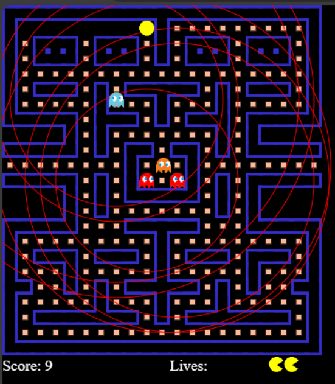

# Pacman Clone

Welcome to the **Pacman Clone** project! This repository contains a fun and interactive Pacman game built with JavaScript and HTML5.

## 🚀 Features

- **Classic Gameplay**: Relive the nostalgia with classic Pacman gameplay.
- **Responsive Design**: Enjoy on various devices with a responsive layout.
- **Customizable**: Easily tweak game settings such as speed, difficulty, and more.
- **High Scores**: Track your highest scores and compete with friends.

## 🛠️ Technologies Used

- **HTML5 Canvas**: For rendering the game graphics.
- **JavaScript (ES6)**: Core game logic and interactions.
## Screenshot

